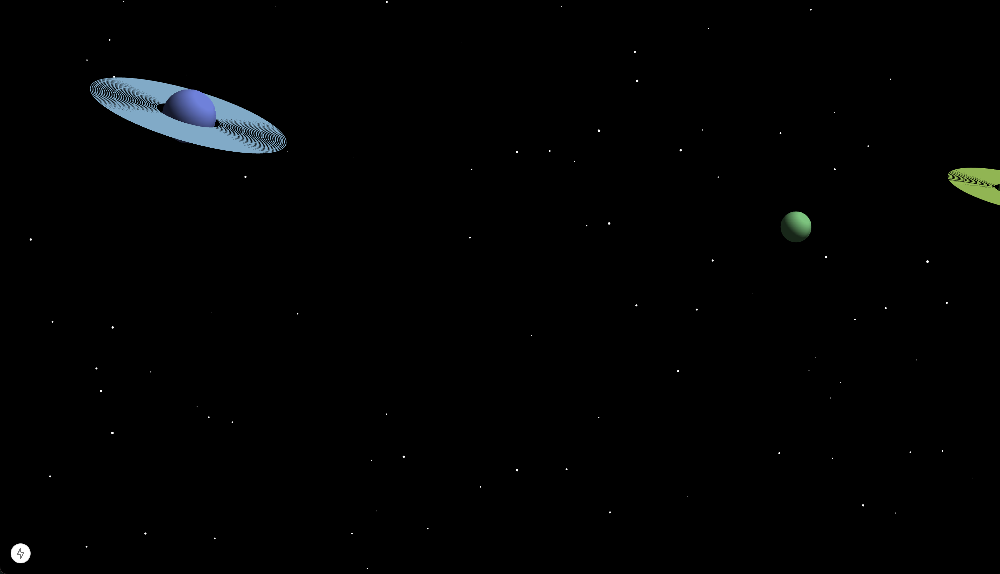
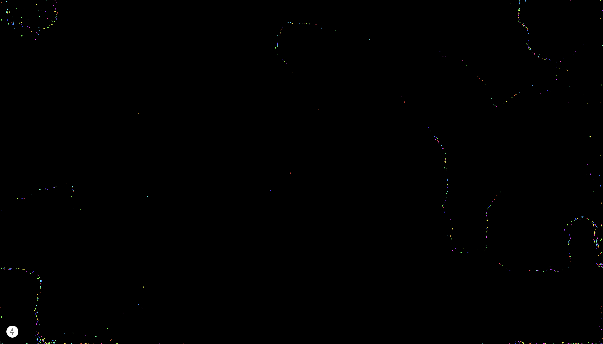
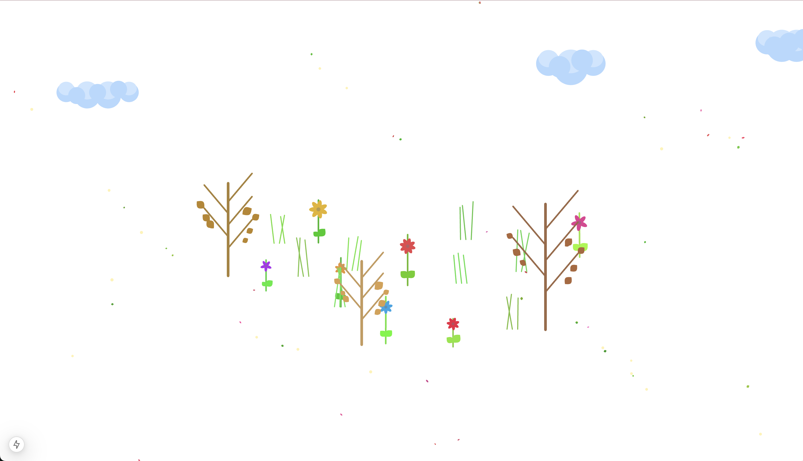

# Interactive Scene Controller

A real-time interactive scene controller built with Next.js and Bun, featuring WebSocket communication between control and display interfaces. Providing your name and your country input will display it on the screen real-time.

## Tech Stack

### Frontend

- **Next.js 14**
- **TypeScript**
- **Tailwind CSS**
- **p5.js**

### Backend

- **Bun**
- **Hono**
- **WebSocket**

## Project Structure

```
.
├── backend/
│   ├── src/
│   │   ├── index.ts          # Main server entry point
│   │   └── types/           # Shared type definitions
│   └── package.json
│
└── frontend/
    ├── src/
    │   ├── app/             # Next.js app router pages
    │   │   ├── control/     # Control interface
    │   │   └── display/     # Display interface
    │   ├── components/      # Reusable React components
    │   │   ├── ui/          # Shadcn UI components
    │   │   └── select-with-flag.tsx  # Country selector
    │   ├── scenes/          # Interactive scenes
    │   │   ├── space/       # Space scene with planets
    │   │   ├── flow-field/  # Flow field particles
    │   │   └── garden/      # Interactive garden
    │   └── types/          # Shared type definitions
    └── package.json
```

## Features

### Interactive Scenes

#### Space Scene



- Dynamic star field with parallax effect
- Procedurally generated planets with rings
- Camera panning and user interaction
- Real-time user details particles

#### Flow Field Scene



- Dynamic vector field visualization
- Interactive particle system
- Mouse force field interaction
- User details integration

#### Garden Scene



- Interactive plant growth system
- Dynamic wind effects
- Cloud system with parallax
- Particle effects (petals, leaves)
- User details integration

### Scene Architecture

Each scene follows a modular system-based architecture:

- Separate systems for different functionalities (particles, user details, etc.)
- Centralized constants and type definitions
- Consistent resize handling
- WebSocket integration for real-time updates

### Real-time Scene Control

- Multiple interactive scenes (Space, Flow Field, Garden, and more to come)
- Real-time synchronization between control and display interfaces
- Lazy-loaded scene components for optimal performance
- Toast notifications for scene changes and sync events

### WebSocket Communication

- Bidirectional real-time updates
- Client type registration (control/display)
- Scene state persistence across page refreshes
- Connection status handling and error recovery

## Getting Started

1. Clone the repository
2. Install dependencies:

   ```bash
   # Install both backend and frontend dependencies
   bun install
   ```

3. Start the development servers:

   ```bash
   # Start backend server (from root directory)
   bun dev:backend

   # Start frontend server (from root directory)
   bun dev:frontend
   ```

4. Open your browser:
   - Control interface: [http://localhost:3000/control](http://localhost:3000/control) (Live: [https://interactv.vercel.app/control](https://interactv.vercel.app/control))
   - Display interface: [http://localhost:3000/display](http://localhost:3000/display) (Live: [https://interactv.vercel.app/display](https://interactv.vercel.app/display))

## Environment Setup

### Backend

```env
PORT=3001              # HTTP server port
WS_PORT=3002          # WebSocket server port
FRONTEND_URL=http://localhost:3000  # Frontend URL
```

### Frontend

```env
NEXT_PUBLIC_WS_BACKEND_URL=ws://localhost:3002  # WebSocket server URL
NEXT_PUBLIC_DISPLAY_URL=http://localhost:3000/display  # Display page URL
```

## Contributing

Currently not accepting contributions.
